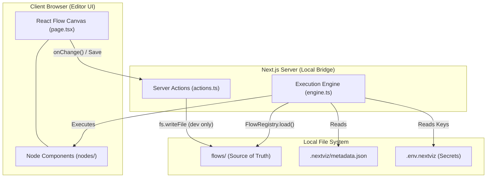
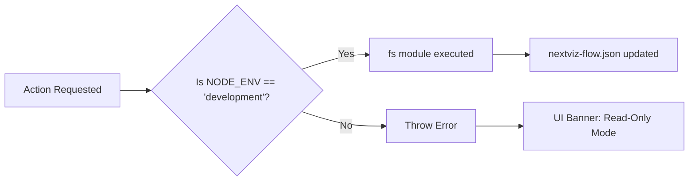

# 🗺️ NextViz Project Masterplan

This document outlines the strategic phases and architecture for **NextViz**, a local-first, node-based automation engine for the Next.js ecosystem.

## 🏗️ Phase 1: Foundation & Project Scaffolding
- [x] Initialize Next.js 15+ App Router project.
- [x] Install core visual engine & UI dependencies (`reactflow`, `lucide-react`, `shadcn/ui`, `tailwind-merge`).
- [x] Scaffold NextViz specific directory structure (`app/nextviz`, `app/api/nextviz`, `lib/nextviz`).
- [x] Establish environment configuration rules (`.env.nextviz` isolated from standard `.env`).
- [x] Ensure `.gitignore` ignores `.env.nextviz` and local agent logs.

## 🌉 Phase 2: The Local Bridge & Visual Canvas
- [x] Setup core UI foundation: shadcn/ui components, NextViz dark theme aesthetic (`bg-zinc-950`), and sidebar layout.
- [x] Define precise Workflow Schema (nodes and edges) using Zod for type-safe validation.
- [x] Implement the React Flow Canvas in `/app/nextviz/page.tsx` with `variant="dots"` background and custom semantic tokens.
- [x] Setup initial UI for basic nodes (e.g., Manual Trigger, HTTP Action) for the visual canvas.
- [x] Build the "Local Bridge" Server Actions (`lib/nextviz/actions.ts`) to read/write from `nextviz-flow.json`. 
- [x] Implement state management and **Auto-save (Live-Sync)** on every node/edge change for magical, instant VS Code synchronization.
- [x] **Critical Security:** Implement the Production Guard environment check (`process.env.NODE_ENV !== 'development'`).
- [x] Build the Read-Only UI overlay for non-localhost environments.
- [x] Implement multi-sidebar architecture (Left Flows Dropdown, Right Draggable Components).

## 🗂️ Phase 3.5: Flow Restructuring & Flow Registry (ARCHITECTURAL UPGRADE)

### ✅ COMPLETE

Migrated from monolithic `nextviz-flow.json` to individual flow files in `flows/` directory:

- [x] Move each flow to `flows/{flow-id}.json` to eliminate git merge conflicts.
- [x] Build a `FlowRegistry` utility in `lib/nextviz/registry.ts` that auto-discovers flows in the `flows/` folder at runtime.
- [x] Update Server Actions (`lib/nextviz/actions.ts`) to save/load flows individually instead of the entire monolith.
- [x] Update the Canvas Editor to use `FlowRegistry.loadFlow(activeFlowId)` instead of reading from a static JSON file.
- [x] Maintain backward compatibility for in-memory active flow state (UI still tracks `activeFlowId`).
- [x] Convert `page.tsx` to server component for clean URL-based flow switching with `key={flowId}` remounting.
- [x] Add `FlowsContext` for shared flows list across components.
- [x] Update sidebar to dynamically list flows and highlight the active one.

### Design Decisions

| Decision | Old (Monolithic) | New (Individual) | Benefit |
|----------|------------------|------------------|---------|
| **Storage** | `nextviz-flow.json` (all flows in one file) | `flows/{flow-id}.json` (one file per flow) | No merge conflicts |
| **Git Strategy** | Track entire flow array | Track individual flows | Team members work independently |
| **Scale** | ~1MB = ~100 flows before slowdown | Unlimited | Enterprise-ready |
| **Discovery** | Manual array iteration | Auto-scan `flows/` directory | Developer ergonomics |
| **CLI Template** | Confusing (is this an example?) | Clear (flows/ = user space) | Better onboarding |

### Why This Matters

- ✅ **No merge conflicts** when team members work on different flows.
- ✅ **Clear separation** between framework code (`lib/nextviz/`) and user flows (`flows/`).
- ✅ **Scales to 100+ flows** without file size bloat.
- ✅ **Template clarity** for `npx nextviz init`—users know exactly where to put their flows.
- ✅ **Future-proof** for CI/CD: can deploy individual flows independently.

---

## ⚙️ Phase 3: Core Nodes & Execution Engine
- [x] Support multi-flow management and custom Add Flow modals with name/description in JSON schema.
- [x] Define the strict TypeScript interfaces (`NextVizNode`, `WorkflowJSON`) in `lib/nextviz/types.ts`.
- [x] Implement the primary Execution Engine (`lib/nextviz/engine.ts`) using the `executeFlow("name", payload)` direct invocation pattern.
- [x] **Performance:** Build a topological sort mechanism that parses the graph and caches the "Execution Plan" in memory to eliminate JSON parsing overhead on subsequent runs.
- [x] Ensure a **"Headless" Engine** design: `engine.ts` must be completely decoupled from the UI, allowing Vercel to run automations via Webhooks or pure Server Actions.
- [x] Develop the fundamental **Trigger** node: `onHTTP` (Webhook receiver).
- [x] Develop the fundamental **Action** node: `logData` (Console/File logger).

## 🔥 Phase 4: Heavy Hitters — n8n Component Recreation

> **Philosophy:** To build NextViz into a powerhouse, you don't need to copy all 400+ n8n nodes. You just need the "Heavy Hitters"—the ones that power 90% of real automations.

### 4.1 — The Node Roster

| Category  | Node Name            | Purpose in NextViz                                                          |
|-----------|----------------------|-----------------------------------------------------------------------------|
| Triggers  | Webhook (onHTTP)     | ✅ Done — Starts a flow when an external service sends a POST/GET request.  |
| Triggers  | Schedule (Cron)      | Runs a flow every hour, day, or specific minute.                            |
| AI        | OpenAI / Anthropic   | ✅ Done — Covered by the AI Agent node (model selector, memory, tools).     |
| AI        | Vector Store         | Connects to Supabase `pgvector` for RAG (retrieval augmented generation).  |
| Logic     | Filter / If-Else     | The fork in the road. `if (user.paid) -> allow`.                            |
| Logic     | Code (JS)            | The "Escaper." For when the UI isn't enough—write raw JS logic.             |
| Data      | Supabase DB          | The "Memory." Create, Read, Update, or Delete rows.                         |
| Data      | HTTP Request         | ✅ Done — Method selector, URL, headers builder, body, auth (Bearer/API Key/Basic). |
| Messaging | Discord / Slack      | The "Voice." Sends notifications to a channel.                              |
| Messaging | Gmail / Resend       | The "Letters." Sends emails to users or yourself.                           |

### 4.2 — Implementation Checklist

#### Tier 1: Triggers & Scheduling
- [x] **Webhook (onHTTP)** — HTTP Trigger node (complete, Phase 3)
- [x] **Schedule (Cron)** — UI: time picker + cron expression editor. Executor: `node-schedule`. Output: `{ executedAt: string }`

#### Tier 2: AI & Intelligence
- [x] **OpenAI / Anthropic** — Superseded by the **AI Agent** node (`ai-agent/`), which provides model selection, memory, tools, system message config, and chat trigger integration. No standalone LLM call node needed.
- [ ] **Vector Store (pgvector)** — UI: action selector (embed/query/upsert). Supabase RAG integration. Output: `{ results: [], similarity_scores: [] }`

#### Tier 3: Logic & Control Flow
- [ ] **Filter / If-Else** — UI: visual condition builder (field > value, equals, contains, regex), AND/OR logic, multiple branches
- [ ] **Code (JavaScript)** — UI: Monaco editor with syntax highlighting. Runtime: sandboxed execution. Input: all upstream outputs via context

#### Tier 4: Data & Persistence
- [ ] **Supabase DB (CRUD)** — UI: table/RPC selector + query builder. Ops: SELECT, INSERT, UPDATE, DELETE, RPC. Output: `{ data: [], rowCount: number }`
- [x] **HTTP Request** — UI: method selector + URL + headers + body. Auth: Basic, Bearer, API key. Output: `{ status: number, body: any, headers: {} }`

#### Tier 5: Messaging & Notifications
- [ ] **Discord / Slack** — UI: channel selector + message formatter. Ops: send to channel, thread, DM. Output: `{ messageId: string, timestamp: number }`
- [ ] **Gmail / Resend** — UI: recipient + subject + HTML body + attachments. Template: variable injection from upstream nodes. Output: `{ emailId: string, status: 'sent' | 'queued' }`

---

### 4.3 — Customizability: The "Vibe Coder" Properties Sidebar

In n8n, the UI is often cluttered. NextViz aims for clean UI for simple tasks, raw power for complex ones.

**When a user clicks a node, a sidebar slides out.** Here's how it should work:

#### Variable Mapping (Output → Input)
If Node A fetches a user, Node B can reference it via a **variable picker**. Use template syntax:
```
{{ $node["NodeName"].data.email }}     ← n8n-style (verbose but explicit)
{{ user_email }}                        ← NextViz-style (modern dropdown picker)
```
Both are resolved at runtime by the engine's context injector.

#### Secret Management Bridge
API keys are **never typed directly** into a node's UI field. Instead, a `viz-connection` dropdown reads available keys from `.env.nextviz` and presents them by name:
```
OpenAI Key:  [ OPENAI_API_KEY ▼ ]   ← dropdown, not a text field
             [ SECONDARY_AI_KEY  ]
```
The node stores the **key name** (e.g., `"OPENAI_API_KEY"`) in its `data` field. The executor resolves `process.env[keyName]` at runtime.

#### The "Raw Toggle"
Every field in the Properties Sidebar should support two modes:
| Mode           | Behavior                                         |
|----------------|--------------------------------------------------|
| Fixed Value    | Static text input                                |
| Expression     | Inline JS/template evaluated at runtime          |

A small toggle icon (e.g., a `</>` button) switches between modes inline.

---

### 4.4 — Custom Node Design: The NextViz Manifest Pattern

Since NextViz is designed for developers to extend, every custom node is a **two-file folder**:

```
app/nextviz/nodes/my-node/
├── node.tsx       ← UI: how the node looks on the canvas
└── logic.ts       ← Executor: the server-side code that runs
```

This mirrors the `NodeExecutorFn` signature already defined in `lib/nextviz/types.ts`.

#### Pre-Built `viz-*` Sidebar UI Primitives
The engine should provide these reusable components so node builders don't start from scratch:

| Component          | Purpose                                                        |
|--------------------|----------------------------------------------------------------|
| `viz-input`        | Basic text / number input                                      |
| `viz-select`       | Dropdown for static options                                    |
| `viz-code-editor`  | Small Monaco / CodeMirror window for JS snippets               |
| `viz-connection`   | API key picker — reads keys from `.env.nextviz` automatically  |

---

### 4.5 — Execution Flow Logic (Visual Feedback)

When a user hits "Run" or a Webhook is triggered:

1. **Hydration** — The engine reads `flows/{flowId}.json` (or uses the cached execution plan).
2. **Context Injection** — Variables from `.env.nextviz` are injected into the execution context.
3. **Step-by-Step** — Node 1 executes, its output is passed to Node 2, and so on (topological order).
4. **Visual Feedback** — The UI polls for execution state and renders node status in real-time:
   - `running` → pulsing `border-primary`
   - `success` → `border-green-500` + ✅ checkmark overlay
   - `error` → `border-destructive` + ❌ overlay with error message tooltip

> **Vibe Feature:** Right-click a node → "Convert to Code." The UI settings are serialized into a raw TypeScript function the user can copy-paste and own forever. Peak Vibe Coding.

---

## 📦 Phase 5: The CLI Engine (Distributor)
- [ ] Package the working implementation into a CLI template structure.
- [ ] Implement `npx nextviz init` to scaffold the editor in an existing Next.js app.
- [ ] Implement `npx nextviz add <node-name>` to inject specialized component logic over the network.

---

## 📐 System Architecture Overview



---

## 🚦 Security Guardrails


---

## 📖 Additional Documentation

- **[FOLDER_STRUCTURE.md](./FOLDER_STRUCTURE.md)** — Detailed breakdown of the Phase 3.5 folder layout, responsibilities, and best practices.
- **[engine-architecture.md](./engine-architecture.md)** — Engine design patterns, the `executeFlow` API, and orchestrator principles.
