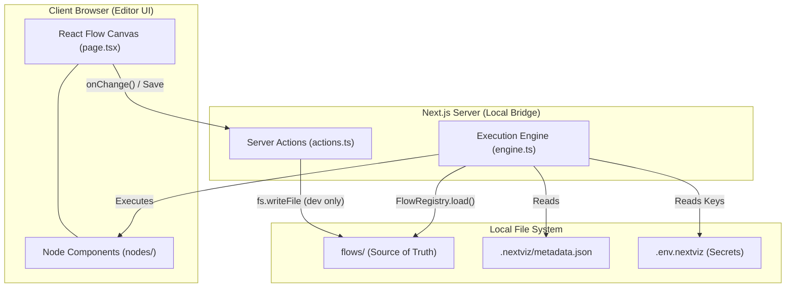
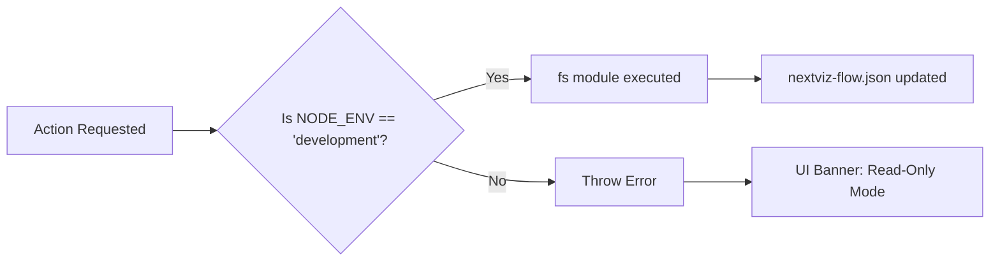

# 🗺️ NextViz Project Masterplan

This document outlines the strategic phases and architecture for **NextViz**, a local-first, node-based automation engine for the Next.js ecosystem.

## 🏗️ Phase 1: Foundation & Project Scaffolding
- [x] Initialize Next.js 15+ App Router project.
- [x] Install core visual engine & UI dependencies (`reactflow`, `lucide-react`, `shadcn/ui`, `tailwind-merge`).
- [x] Scaffold NextViz specific directory structure (`app/nextviz`, `app/api/nextviz`, `lib/nextviz`).
- [x] Establish environment configuration rules (`.env.nextviz` isolated from standard `.env`).
- [x] Ensure `.gitignore` ignores `.env.nextviz` and local agent logs.

## 🌉 Phase 2: The Local Bridge & Visual Canvas
- [x] Setup core UI foundation: shadcn/ui components, NextViz dark theme aesthetic (`bg-zinc-950`), and sidebar layout.
- [x] Define precise Workflow Schema (nodes and edges) using Zod for type-safe validation.
- [x] Implement the React Flow Canvas in `/app/nextviz/page.tsx` with `variant="dots"` background and custom semantic tokens.
- [x] Setup initial UI for basic nodes (e.g., Manual Trigger, HTTP Action) for the visual canvas.
- [x] Build the "Local Bridge" Server Actions (`lib/nextviz/actions.ts`) to read/write from `nextviz-flow.json`. 
- [x] Implement state management and **Auto-save (Live-Sync)** on every node/edge change for magical, instant VS Code synchronization.
- [x] **Critical Security:** Implement the Production Guard environment check (`process.env.NODE_ENV !== 'development'`).
- [x] Build the Read-Only UI overlay for non-localhost environments.
- [x] Implement multi-sidebar architecture (Left Flows Dropdown, Right Draggable Components).

## 🗂️ Phase 3.5: Flow Restructuring & Flow Registry (ARCHITECTURAL UPGRADE)

### ✅ COMPLETE

Migrated from monolithic `nextviz-flow.json` to individual flow files in `flows/` directory:

- [x] Move each flow to `flows/{flow-id}.json` to eliminate git merge conflicts.
- [x] Build a `FlowRegistry` utility in `lib/nextviz/registry.ts` that auto-discovers flows in the `flows/` folder at runtime.
- [x] Update Server Actions (`lib/nextviz/actions.ts`) to save/load flows individually instead of the entire monolith.
- [x] Update the Canvas Editor to use `FlowRegistry.loadFlow(activeFlowId)` instead of reading from a static JSON file.
- [x] Maintain backward compatibility for in-memory active flow state (UI still tracks `activeFlowId`).
- [x] Convert `page.tsx` to server component for clean URL-based flow switching with `key={flowId}` remounting.
- [x] Add `FlowsContext` for shared flows list across components.
- [x] Update sidebar to dynamically list flows and highlight the active one.

### Design Decisions

| Decision | Old (Monolithic) | New (Individual) | Benefit |
|----------|------------------|------------------|---------|
| **Storage** | `nextviz-flow.json` (all flows in one file) | `flows/{flow-id}.json` (one file per flow) | No merge conflicts |
| **Git Strategy** | Track entire flow array | Track individual flows | Team members work independently |
| **Scale** | ~1MB = ~100 flows before slowdown | Unlimited | Enterprise-ready |
| **Discovery** | Manual array iteration | Auto-scan `flows/` directory | Developer ergonomics |
| **CLI Template** | Confusing (is this an example?) | Clear (flows/ = user space) | Better onboarding |

### Why This Matters

- ✅ **No merge conflicts** when team members work on different flows.
- ✅ **Clear separation** between framework code (`lib/nextviz/`) and user flows (`flows/`).
- ✅ **Scales to 100+ flows** without file size bloat.
- ✅ **Template clarity** for `npx nextviz init`—users know exactly where to put their flows.
- ✅ **Future-proof** for CI/CD: can deploy individual flows independently.

---

## ⚙️ Phase 3: Core Nodes & Execution Engine
- [x] Support multi-flow management and custom Add Flow modals with name/description in JSON schema.
- [x] Define the strict TypeScript interfaces (`NextVizNode`, `WorkflowJSON`) in `lib/nextviz/types.ts`.
- [x] Implement the primary Execution Engine (`lib/nextviz/engine.ts`) using the `executeFlow("name", payload)` direct invocation pattern.
- [x] **Performance:** Build a topological sort mechanism that parses the graph and caches the "Execution Plan" in memory to eliminate JSON parsing overhead on subsequent runs.
- [x] Ensure a **"Headless" Engine** design: `engine.ts` must be completely decoupled from the UI, allowing Vercel to run automations via Webhooks or pure Server Actions.
- [x] Develop the fundamental **Trigger** node: `onHTTP` (Webhook receiver).
- [x] Develop the fundamental **Action** node: `logData` (Console/File logger).

## 🧠 Phase 4: Advanced Integrations (Services)
- [ ] Implement the `aiGenerate` action node utilizing OpenAI.
- [ ] Implement Supabase service nodes (Database read/write) keeping Service Role keys strictly in the server.
- [ ] Add the Logic Nodes (If/Else branching).

## 📦 Phase 5: The CLI Engine (Distributor)
- [ ] Package the working implementation into a CLI template structure.
- [ ] Implement `npx nextviz init` to scaffold the editor in an existing Next.js app.
- [ ] Implement `npx nextviz add <node-name>` to inject specialized component logic over the network.

---

## 📐 System Architecture Overview

---

## 🚦 Security Guardrails

---

## 📖 Additional Documentation

- **[FOLDER_STRUCTURE.md](./FOLDER_STRUCTURE.md)** — Detailed breakdown of the Phase 3.5 folder layout, responsibilities, and best practices.
- **[engine-architecture.md](./engine-architecture.md)** — Engine design patterns, the `executeFlow` API, and orchestrator principles.
