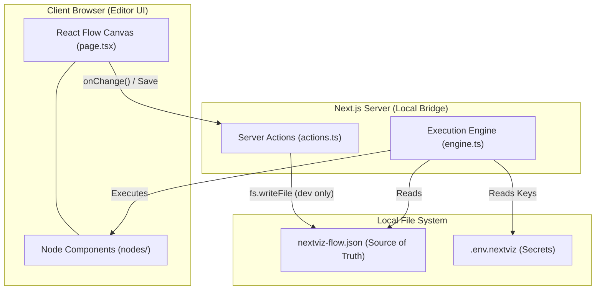
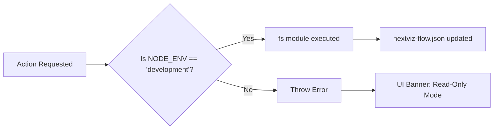

# 🗺️ NextViz Project Masterplan

This document outlines the strategic phases and architecture for **NextViz**, a local-first, node-based automation engine for the Next.js ecosystem.

## 🏗️ Phase 1: Foundation & Project Scaffolding
- [x] Initialize Next.js 15+ App Router project.
- [x] Install core visual engine & UI dependencies (`reactflow`, `lucide-react`, `shadcn/ui`, `tailwind-merge`).
- [x] Scaffold NextViz specific directory structure (`app/nextviz`, `app/api/nextviz`, `lib/nextviz`).
- [x] Establish environment configuration rules (`.env.nextviz` isolated from standard `.env`).
- [x] Ensure `.gitignore` ignores `.env.nextviz` and local agent logs.

## 🌉 Phase 2: The Local Bridge & Visual Canvas
- [x] Setup core UI foundation: shadcn/ui components, NextViz dark theme aesthetic (`bg-zinc-950`), and sidebar layout.
- [x] Define precise Workflow Schema (nodes and edges) using Zod for type-safe validation.
- [x] Implement the React Flow Canvas in `/app/nextviz/page.tsx` with `variant="dots"` background and custom semantic tokens.
- [x] Setup initial UI for basic nodes (e.g., Manual Trigger, HTTP Action) for the visual canvas.
- [x] Build the "Local Bridge" Server Actions (`lib/nextviz/actions.ts`) to read/write from `nextviz-flow.json`. 
- [ ] Implement state management and **Auto-save (Live-Sync)** on every node/edge change for magical, instant VS Code synchronization.
- [ ] **Critical Security:** Implement the Production Guard environment check (`process.env.NODE_ENV !== 'development'`).
- [ ] Build the Read-Only UI overlay for non-localhost environments.

## ⚙️ Phase 3: Core Nodes & Execution Engine
- [ ] Define the strict TypeScript interfaces (`NextVizNode`, `WorkflowJSON`) in `lib/nextviz/types.ts`.
- [ ] Implement the primary Execution Engine (`lib/nextviz/engine.ts`) capable of traversing the graph and resolving inputs/outputs.
- [ ] Ensure a **"Headless" Engine** design: `engine.ts` must be completely decoupled from the UI, allowing Vercel to run automations via Webhooks without ever loading the `/nextviz` page.
- [ ] Develop the fundamental **Trigger** node: `onHTTP` (Webhook receiver).
- [ ] Develop the fundamental **Action** node: `logData` (Console/File logger).

## 🧠 Phase 4: Advanced Integrations (Services)
- [ ] Implement the `aiGenerate` action node utilizing OpenAI.
- [ ] Implement Supabase service nodes (Database read/write) keeping Service Role keys strictly in the server.
- [ ] Add the Logic Nodes (If/Else branching).

## 📦 Phase 5: The CLI Engine (Distributor)
- [ ] Package the working implementation into a CLI template structure.
- [ ] Implement `npx nextviz init` to scaffold the editor in an existing Next.js app.
- [ ] Implement `npx nextviz add <node-name>` to inject specialized component logic over the network.

---

## 📐 System Architecture Overview

---

## 🚦 Security Guardrails

